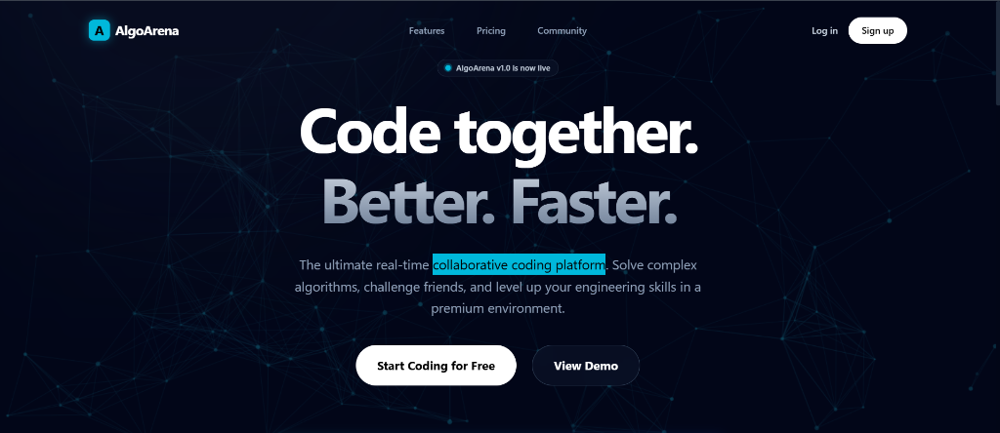
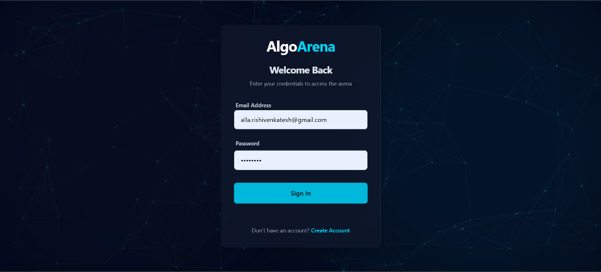
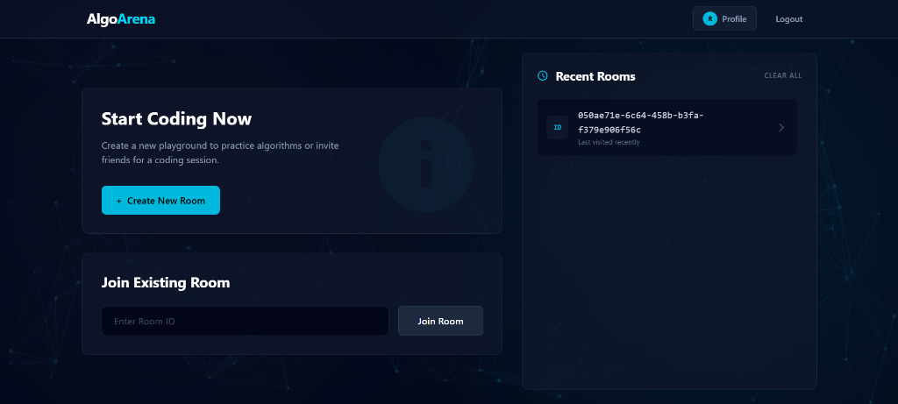
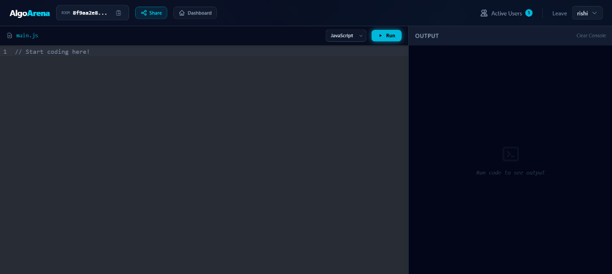
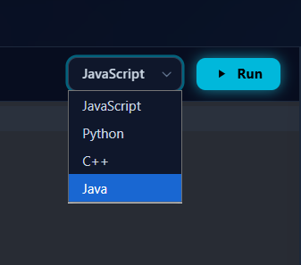
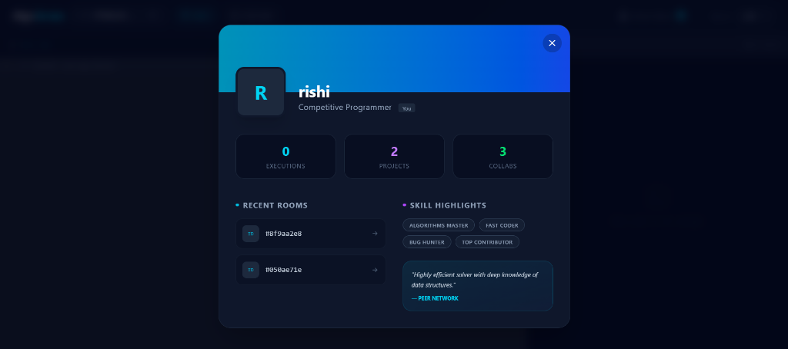
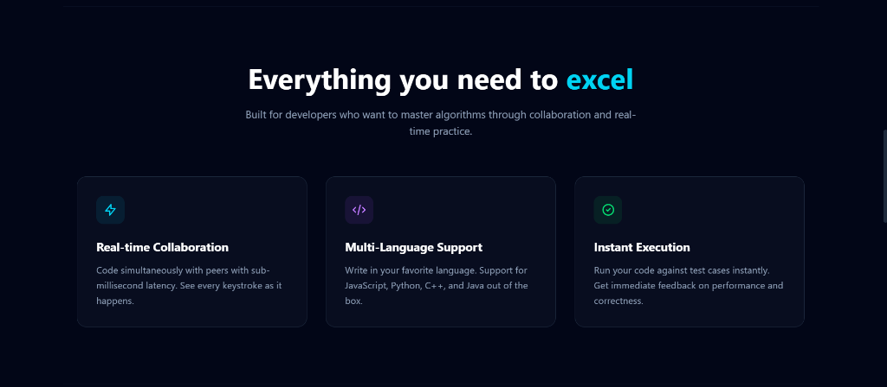

# AlgoArena

**Real-Time Collaborative Coding Platform**



AlgoArena is a web application where developers can code together in real-time. You can solve problems, share your screen, and run your code instantly.

## How It Looks

### Login


### Dashboard


### Code Editor


### Languages Supported


### User Profile


### Features and Community



## What You Can Do

*   **Code Together**: Edit the same file with other people at the same time.
*   **Run Code**: Compile and run your code in Python, JavaScript, C++, and Java directly in your browser.
*   **See Who Is Online**: Know when other people join or leave your coding room.

## What Was Used To Build It

**Frontend (What you see)**
*   React 18
*   Tailwind CSS (for styling)
*   CodeMirror (for the code editor)
*   Socket.io Client (to connect to the server)

**Backend (How it works in the background)**
*   Node.js and Express.js
*   MongoDB (to store data)
*   Socket.io (to send messages in real time)
*   Piston API (to run the code safely)

## How To Run It On Your Computer

### What You Need First
*   Node.js installed
*   MongoDB installed or an online MongoDB database
*   Git

### Steps

1.  **Download the Code**

    ```bash
    git clone https://github.com/AllaRishiVenkatesh/Algo-Arena-collaborative-coding-platform-Project-.git
    cd Algo-Arena-collaborative-coding-platform-Project-
    ```

2.  **Set Up the Backend (Server)**

    Go to the backend folder and install what is needed:

    ```bash
    cd backend
    npm install
    ```

    Create a file named `.env` in the `backend` folder and add these lines:

    ```env
    MONGODB_URL=your_mongodb_connection_string
    JWT_SECRET=your_secure_secret_key
    PORT=3000
    ```

    Start up the server:

    ```bash
    npm start
    ```

3.  **Set Up the Frontend (Website)**

    Open a new terminal, go to the frontend folder, and install what is needed:

    ```bash
    cd frontend
    npm install
    ```

    Create a file named `.env` in the `frontend` folder and add this line:

    ```env
    VITE_BACKEND_URL=http://localhost:3000
    ```

    Start the website:

    ```bash
    npm run dev
    ```

4.  **Open the Application**

    Open your web browser and go to: `http://localhost:5173`

## How To Use It

1.  **Sign Up**: Create an account to save your information.
2.  **Create a Room**: Go to the dashboard and make a new room. You will get a Room ID.
3.  **Join a Room**: Give the Room ID to your friends so they can join you.
4.  **Write Code**: Type your code in the editor. Everyone in the room will see it change.
5.  **Run Code**: Click the "Run" button to see the output of your code.

## License

This project uses the MIT License.

## Author

**Alla Rishi Venkatesh**
*   GitHub: [AllaRishiVenkatesh](https://github.com/AllaRishiVenkatesh)
