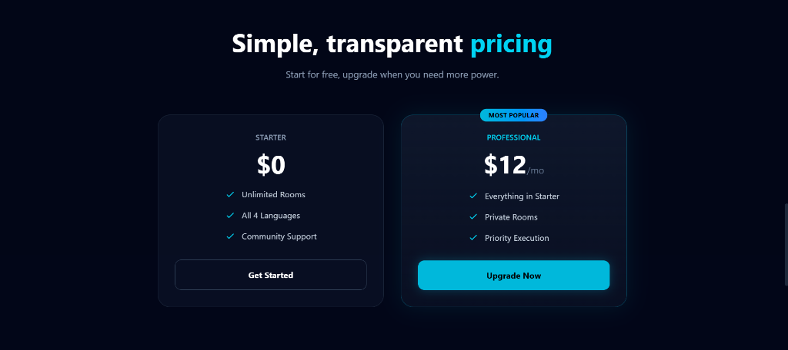

# AlgoArena - Real-Time Collaborative Coding Platform 🚀

<div align="center">


**Code together. Better. Faster.**

A premium real-time collaborative IDE where developers solve algorithmic challenges, share coding sessions, and level up their engineering skills.

[](http://localhost:5173)
[](LICENSE)
[](https://nodejs.org)
[](https://reactjs.org)
[](https://www.mongodb.com)

[Features](#-key-features) • [Demo](#-demo) • [Installation](#-installation) • [Tech Stack](#-tech-stack) • [Contributing](#-contributing)

</div>

---

## 🌟 Key Features

### 💻 **Real-Time Collaboration**
- **Live Code Synchronization** - See every keystroke in real-time with sub-100ms latency
- **Active User Tracking** - Know who's online and coding with you
- **Instant Language Switching** - Seamlessly change between JavaScript, Python, C++, and Java

### ⚡ **Code Execution Engine**
- **Multi-Language Support** - Run code in 4+ programming languages
- **Instant Output** - View console results in milliseconds
- **Syntax Highlighting** - Advanced CodeMirror 6 editor with intelligent autocomplete
- **Error Handling** - Clear error messages and timeout management

### 👥 **Social Coding Network**
- **User Profiles** - Track executions, projects, and collaborations
- **Profile Discovery** - Click any username to view their stats
- **Activity Tracking** - See recent coding sessions and achievements
- **Persistent Stats** - MongoDB-backed global leaderboards

### 🎨 **Premium UI/UX**
- **Glassmorphism Design** - Modern, translucent panels with backdrop blur
- **Interactive Particle Network** - Live neural graph background animation
- **Dark Mode Optimized** - Easy on the eyes during marathon coding sessions
- **Responsive Design** - Seamless experience on mobile, tablet, and desktop

### 🔐 **Enterprise Security**
- **JWT Authentication** - Stateless, tamper-proof session management
- **Protected Routes** - Middleware-based access control
- **Input Validation** - Zod schemas prevent injection attacks
- **CORS Whitelisting** - Secure cross-origin resource sharing

---

## 🎥 Demo

### 🚀 Landing & Onboarding
| Landing Page | Secure Authentication |
| :---: | :---: |
|  |  |

### 🛠️ Developer Dashboard
| Dashboard Overview | Key Features |
| :---: | :---: |
|  |  |

### 💻 Collaborative Workspace
| Real-Time Editor | Multi-Language Support |
| :---: | :---: |
|  |  |

### 👤 Social & Community
| User Profile | Community Integration |
| :---: | :---: |
|  |  |

### 💰 Flexible Pricing


> **Try it live:** [http://localhost:5173](http://localhost:5173) (after installation)

---

## 🚀 Installation

### Prerequisites
- **Node.js** 16+ ([Download](https://nodejs.org))
- **MongoDB** 5.0+ ([Install](https://www.mongodb.com/try/download/community)) OR MongoDB Atlas account
- **Git** ([Download](https://git-scm.com))

### Quick Start

```bash
# 1. Clone the repository
git clone https://github.com/AllaRishiVenkatesh/Algo-Arena-collaborative-coding-platform-Project-.git
cd Algo-Arena-collaborative-coding-platform-Project-

# 2. Backend Setup
cd backend
npm install

# Create .env file
echo "MONGODB_URL=your_mongodb_connection_string" > .env
echo "JWT_SECRET=your_super_secret_key_here" >> .env

# Start backend server
npm start

# 3. Frontend Setup (in a new terminal)
cd ../frontend
npm install

# Create .env file
echo "VITE_BACKEND_URL=http://localhost:3000" > .env

# Start frontend dev server
npm run dev
```

### 🔧 Environment Variables

**Backend** (`backend/.env`):
```env
MONGODB_URL=mongodb://localhost:27017/algoarena  # or MongoDB Atlas URI
JWT_SECRET=your_random_secret_key_minimum_32_characters
PORT=3000
```

**Frontend** (`frontend/.env`):
```env
VITE_BACKEND_URL=http://localhost:3000
```

### 📦 Production Build

```bash
# Frontend
cd frontend
npm run build

# Serve with a static server
npm install -g serve
serve -s dist -p 5173
```

---

## 🛠️ Tech Stack

<table>
<tr>
<td align="center" width="50%">

### **Frontend**

| Technology | Purpose |
|------------|---------|
| **React 18** | UI Framework |
| **Tailwind CSS** | Styling & Design System |
| **Framer Motion** | Animations & Transitions |
| **CodeMirror 6** | Code Editor Component |
| **Socket.io Client** | Real-time WebSocket |
| **Axios** | HTTP Client |
| **React Router** | Client-side Routing |
| **React Toastify** | Notifications |
| **Canvas API** | Particle Animation |

</td>
<td align="center" width="50%">

### **Backend**

| Technology | Purpose |
|------------|---------|
| **Node.js** | JavaScript Runtime |
| **Express.js** | Web Framework |
| **MongoDB** | NoSQL Database |
| **Mongoose** | ODM Library |
| **Socket.io** | Real-time Engine |
| **JWT** | Authentication |
| **Zod** | Schema Validation |
| **UUID** | Unique ID Generation |
| **CORS** | Cross-Origin Security |

</td>
</tr>
</table>

### **External APIs**
- **Piston API** - Remote code execution engine (40+ languages)

---

## 📖 Usage Guide

### 1️⃣ **Create an Account**
```
Navigate to http://localhost:5173
Click "Sign Up" → Enter credentials → Start coding!
```

### 2️⃣ **Create a Coding Room**
```
Dashboard → "Create New Room" → Share Room ID with friends
```

### 3️⃣ **Join an Existing Room**
```
Dashboard → Enter Room ID → Click "Join Room"
```

### 4️⃣ **Collaborative Coding**
```
1. Select programming language (JavaScript/Python/C++/Java)
2. Write code together in real-time
3. Click "Run" to execute
4. Share results via console output
```

### 5️⃣ **View Profiles**
```
Click any username in "Active Users" → View their stats and achievements
```

---

## 🗂️ Project Structure

```
AlgoArena-main/
│
├── frontend/                    # React application
│   ├── src/
│   │   ├── components/          # React components
│   │   │   ├── HelloPage.jsx    # Landing page
│   │   │   ├── LoginPage.jsx    # Authentication
│   │   │   ├── SignupPage.jsx   # Registration
│   │   │   ├── CreateJoinPage.jsx  # Dashboard
│   │   │   ├── RoomPage.jsx     # Collaborative editor
│   │   │   └── ProfileModal.jsx # User profiles
│   │   ├── api/                 # API services
│   │   │   ├── axios.js         # HTTP client config
│   │   │   └── roomService.js   # Room API
│   │   ├── utils/
│   │   │   └── Particles.js     # Canvas animation
│   │   └── App.jsx              # Root component
│   └── package.json
│
├── backend/                     # Node.js server
│   ├── routes/
│   │   ├── User.js              # Auth endpoints
│   │   ├── Room.js              # Room CRUD
│   │   └── index.js             # Route aggregator
│   ├── middlewares/
│   │   └── auth.js              # JWT verification
│   ├── db.js                    # Mongoose schemas
│   ├── socket.js                # WebSocket handlers
│   ├── index.js                 # Express server
│   ├── config.js                # Environment config
│   └── package.json
│
└── README.md                    # This file
```

---

## 🔌 API Endpoints

### Authentication
```http
POST   /api/auth/signup               # Create new user
POST   /api/auth/signin               # Login user
GET    /api/auth/profile/:username    # Get user profile
POST   /api/auth/profile/increment-execution  # Update execution count
```

### Rooms
```http
POST   /api/rooms/                    # Create new room
GET    /api/rooms/:roomId             # Join room
GET    /api/rooms/get-code/:roomId    # Fetch room code
PUT    /api/rooms/update-code/:roomId # Update room code
PUT    /api/rooms/update-language/:roomId  # Change language
```

### WebSocket Events
```javascript
// Client → Server
socket.emit('join-room', { roomId, username })
socket.emit('code-update', { roomId, code })
socket.emit('set-language', { roomId, language })
socket.emit('leave-room', { roomId, username })

// Server → Client
socket.on('active-users', (users) => {...})
socket.on('update-code', (data) => {...})
socket.on('room-language', (language) => {...})
```

---

## 🎯 Use Cases

| Scenario | How AlgoArena Helps |
|----------|---------------------|
| **Competitive Programming** | Practice LeetCode problems with peers in real-time |
| **Pair Programming** | Collaborative debugging and code reviews |
| **Coding Interviews** | Mock interview simulations with live feedback |
| **Study Groups** | Learn data structures and algorithms together |
| **Hackathons** | Rapid team-based prototyping and deployment |

---

## 🤝 Contributing

Contributions are welcome! Here's how you can help:

1. **Fork the repository**
2. **Create a feature branch** (`git checkout -b feature/AmazingFeature`)
3. **Commit your changes** (`git commit -m 'Add some AmazingFeature'`)
4. **Push to the branch** (`git push origin feature/AmazingFeature`)
5. **Open a Pull Request**

### Development Guidelines
- Follow existing code style (Prettier/ESLint)
- Write meaningful commit messages
- Test your changes thoroughly
- Update documentation as needed

---

## 🐛 Known Issues & Roadmap

### Current Limitations
- [ ] No persistent room history across sessions
- [ ] Limited to 4 programming languages
- [ ] No built-in voice/video chat

### Planned Features
- [ ] AI-powered code suggestions
- [ ] Integrated terminal for command execution
- [ ] Team-based leaderboards
- [ ] Problem library with difficulty ratings
- [ ] GitHub integration for code commits
- [ ] Mobile app (React Native)

---

## 📄 License

This project is licensed under the **MIT License** - see the [LICENSE](LICENSE) file for details.

---

## 👨‍💻 Author

**Alla Rishi Venkatesh**

- GitHub: [@AllaRishiVenkatesh](https://github.com/AllaRishiVenkatesh)
- Portfolio: [Your Portfolio Link]
- LinkedIn: [Your LinkedIn Profile]
- Email: your.email@example.com

---

## 🙏 Acknowledgments

- **Piston API** for code execution infrastructure
- **Socket.io** community for real-time excellence
- **MongoDB** for flexible data modeling
- **React & Tailwind** for rapid UI development
- **Open Source Community** for inspiration and tools

---

## 📊 Project Stats


---

<div align="center">

**If AlgoArena helped you, consider giving it a ⭐ star!**

Made with ❤️ by developers, for developers

[Report Bug](https://github.com/AllaRishiVenkatesh/Algo-Arena-collaborative-coding-platform-Project-/issues) • [Request Feature](https://github.com/AllaRishiVenkatesh/Algo-Arena-collaborative-coding-platform-Project-/issues) • [Documentation](https://github.com/AllaRishiVenkatesh/Algo-Arena-collaborative-coding-platform-Project-/wiki)

</div>
